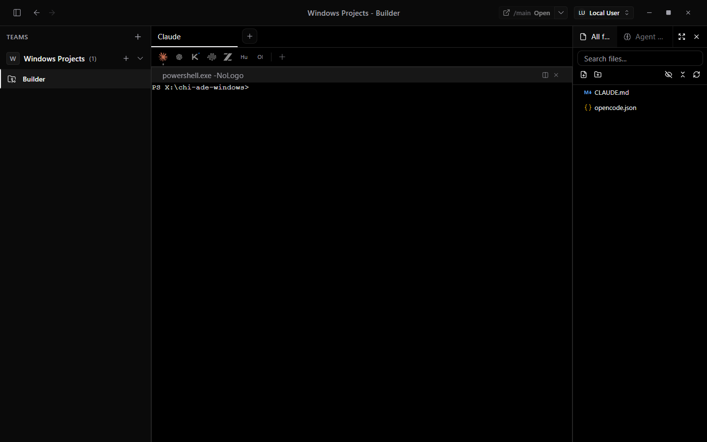
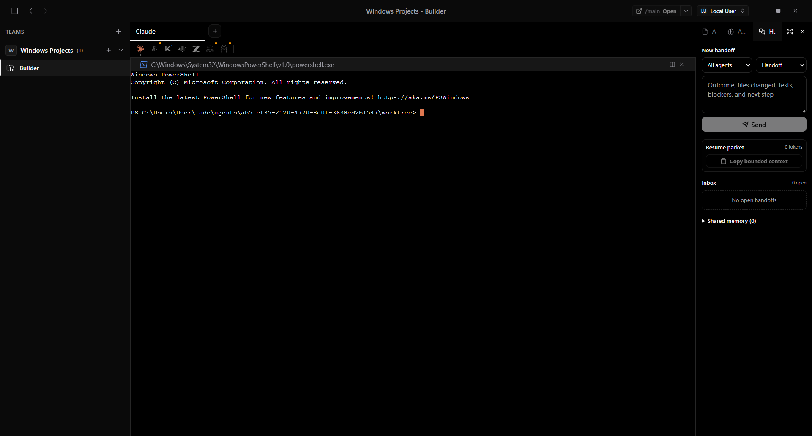
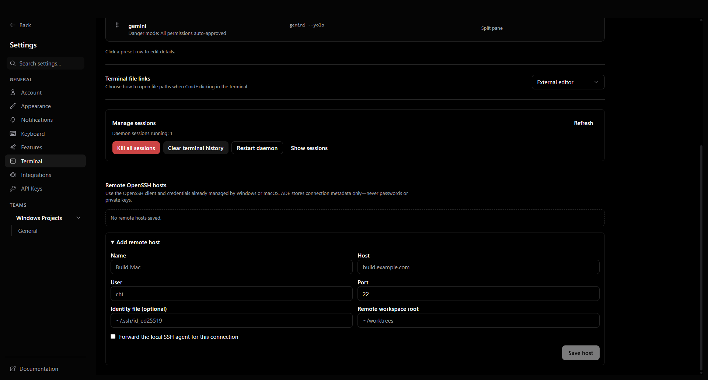
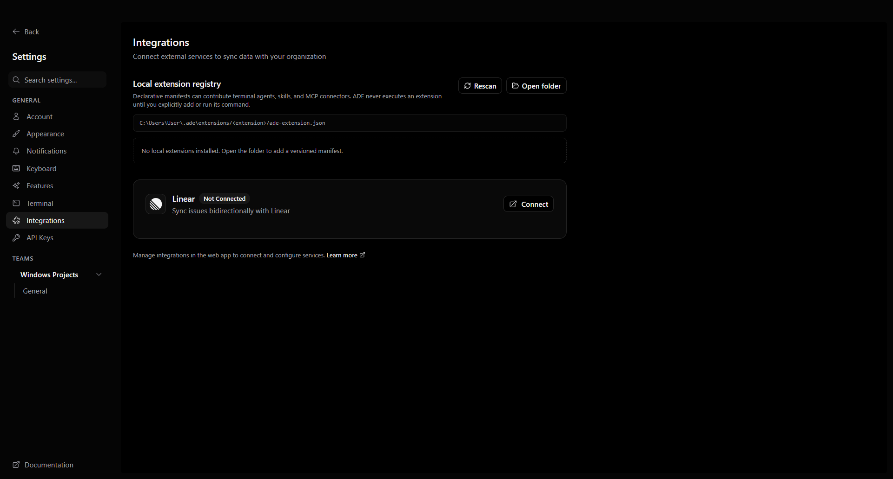
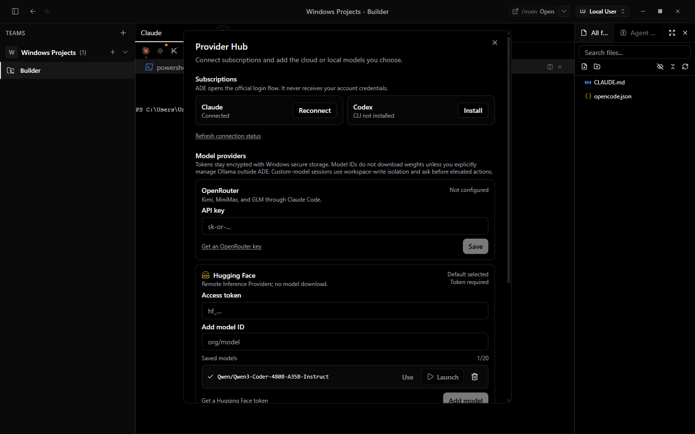
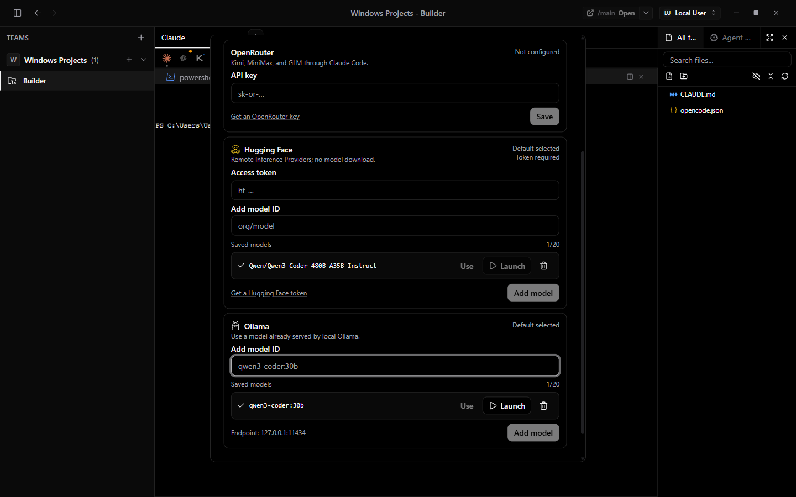
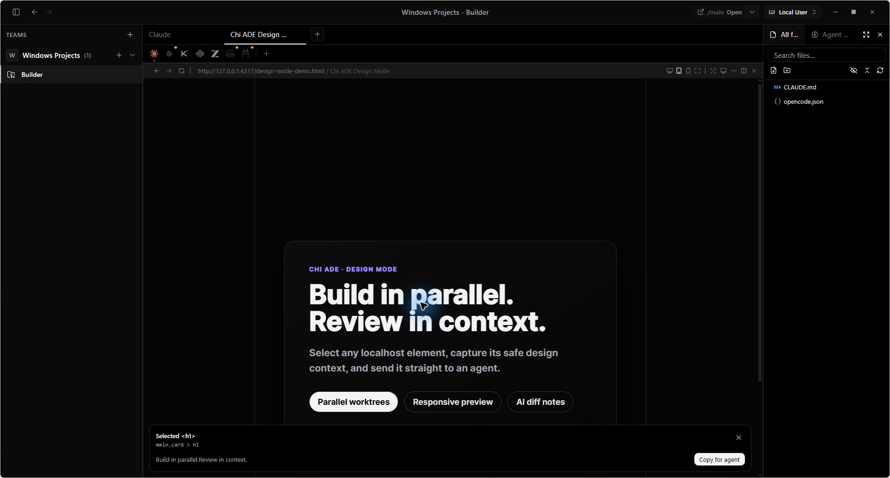
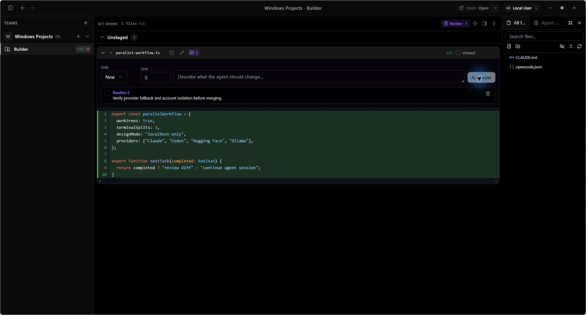
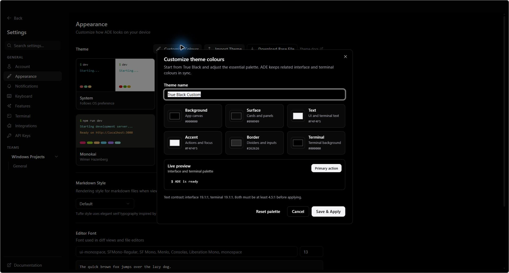

<p align="center">
  
</p>

<h1 align="center">chi-ade-windows</h1>

<p align="center">
  A local-first agentic development environment for Windows and macOS.<br>
  Run coding agents, worktrees, terminals, diffs, and local previews in one workspace.
</p>

<p align="center">
  <a href="https://github.com/Chi944/chi-ade-windows/releases">Releases</a>
  · <a href="https://github.com/Chi944/chi-ade-windows/actions/workflows/ci.yml">Build status</a>
  · <a href="https://github.com/Chi944/chi-ade-windows/issues">Issues</a>
  · <a href="LICENSE.md">License</a>
</p>



> Version 0.4 is currently available from source. The latest public installer remains Windows-only v0.2.1 until signed Windows and notarized macOS v0.4 artifacts are published.

## One workspace, many agents

- **Parallel Git worktrees** keep branches and agents isolated while sharing Git object storage. Existing local repositories can be linked without copying them.
- **Durable agent handoffs** let Claude, Codex, OpenCode, and any terminal agent exchange project-scoped messages, decisions, artifacts, and compact resume packets without sharing provider credentials or raw transcripts.
- **Persistent split panes** place agents, PowerShell or other shells, files, diffs, and browser previews side by side. Layout and bounded terminal history survive restarts.
- **Any terminal agent** can run in ADE. Use a built-in runtime or pin any installed CLI command as a custom Agent Bar preset.
- **Provider Hub** brings Claude and Codex account profiles, Codex usage/reset windows, OpenRouter, remote Hugging Face models, and Ollama models into one place.
- **Design Mode** previews trusted localhost apps at desktop, tablet, or mobile sizes and copies a selected element's safe context for an agent.
- **AI diff annotations** attach persistent notes to exact file/side/line locations and combine unresolved notes into one review prompt.
- **Drag files to agents** pastes safely shell-quoted Explorer or Finder paths into a terminal.
- **Custom appearance** includes a deep true-black theme and editable UI and terminal colours.
- **User-controlled updates** announce new releases; nothing downloads or installs until you choose it.
- **Remote and extensible by default** uses the operating system's OpenSSH client and a declarative local extension registry instead of bundling another runtime.

## Gallery

| Durable cross-agent handoffs | Remote OpenSSH workspaces |
| --- | --- |
|  |  |



| Provider Hub | Remote and local models |
| --- | --- |
|  |  |

| Design Mode | Annotated AI diff review |
| --- | --- |
|  |  |



## Agents and models

ADE does not bundle agent CLIs, subscriptions, model weights, or provider usage.

| Integration | Support |
| --- | --- |
| Claude Code | Official CLI login, isolated profile metadata, persistent panes, and native session resume |
| Codex CLI | Official CLI login, isolated profile metadata, native resume, and on-demand usage/rate-limit windows through the local Codex app-server |
| Gemini CLI | Built-in terminal preset |
| OpenCode | Built-in terminal preset and native session resume |
| GitHub Copilot CLI | Built-in terminal preset |
| Cursor Agent | Built-in terminal preset when the native CLI is installed |
| Any terminal CLI | Save its name and command as a custom pinned preset |
| OpenRouter | Kimi, MiniMax, and GLM routes through Claude Code |
| Hugging Face | Add remote Inference Provider model IDs; weights stay in the cloud |
| Ollama | Select models already served by Ollama; ADE never pulls them automatically |

Conversation-level cold resume is implemented for Claude, Codex, Codex-backed Hugging Face and Ollama sessions, and OpenCode. Other agents retain ADE's pane layout and bounded terminal scrollback; conversation continuation depends on the CLI itself.

## Agent coordination and context

Agents in the same project now share a durable SQLite inbox and explicit project memory. The **Handoffs** sidebar sends targeted or broadcast messages, tracks acknowledgement per recipient, and builds a deterministic resume packet capped at 1,200 estimated tokens by default.

Every ADE terminal receives the cross-platform `ade-coord` command:

```sh
ade-coord peers
ade-coord inbox
ade-coord send <workspace-id|all> "Outcome; files; tests; blocker; next step"
ade-coord context "current objective"
```

Claude and Codex keep separate provider sessions and authentication. They understand each other through explicit summaries, artifacts, decisions, and shared facts—not hidden transcript copying. See [coordination and context](docs/coordination.md).

ADE applies a single compact context policy instead of stacking multiple always-on prompt hooks. Detailed memory rules load on demand. The design is informed by [Ponytail's](https://github.com/DietrichGebert/ponytail) minimal-code guidance and [Caveman's](https://github.com/JuliusBrussee/caveman) structured crew handoffs. [pxpipe](https://github.com/teamchong/pxpipe)-style image encoding remains unbundled because it is model-dependent, lossy for exact identifiers, and would increase the install size.

## Accounts and usage

Each Claude or Codex profile completes its provider's official CLI login once. Selecting a profile affects new panes; running panes and resumed sessions stay pinned to the profile that created them.

ADE stores profile labels, IDs, and pane bindings, while each provider CLI owns its credentials. ADE does not copy or parse those credentials. Codex usage and reset windows are fetched on demand. Claude usage remains available through Claude Code's `/usage` command. Because Claude credentials can also be tied to macOS Keychain, switching a Claude profile on macOS may require the official login flow again.

Provider API tokens entered in ADE are encrypted with Electron secure storage and decrypted in the main process only for matching sessions.

## Updates

Packaged builds check GitHub Releases at startup, every four hours, and when you choose **Check for Updates**:

1. ADE tells you a version is available.
2. You choose **Download** and can watch its progress.
3. You choose **Install & Restart** when ready.

ADE never downloads an update automatically or silently installs one on quit. Differential blockmaps reduce repeat-download size when a release provides them. Stable publishing is intentionally blocked unless the Windows signing and Apple signing/notarization credentials are configured.

The public v0.2.1 build predates this updater, so moving from v0.2.1 to v0.4 requires one manual installer download. Once v0.4 is installed, the in-app flow handles later published versions.

## Storage and privacy

- App state lives under `~/.ade`.
- Existing-folder linking is zero-copy, and Git worktrees share repository objects.
- Terminal scrollback is capped at 5 MiB per pane; the reopen stack retains at most 20 closed tabs.
- Handoffs and shared facts are compact SQLite rows with retention and per-project quotas; resume packets are bounded and raw provider transcripts are not duplicated.
- Hugging Face weights stay remote, and Ollama models remain outside ADE.
- Analytics emission is disabled in this build.
- Agent memory is stored as small Markdown files outside the worktree; see [the memory design](docs/memory.md).

Built-in autonomous presets may use high-permission or auto-approval flags. Review terminal presets before using ADE with untrusted repositories. Custom Hugging Face and Ollama sessions use workspace-write isolation and ask before elevated actions.

Design Mode is limited to `localhost`, `*.localhost`, and `127.0.0.1`. It excludes input values, page HTML, cookies, storage, and `data-*` attributes. Only enable it for local apps you trust.

## Platform status

| Platform | Status |
| --- | --- |
| Windows x64 | v0.4 compiles and packages locally; the packaged native-runtime and full migration smoke tests pass. The latest public release remains v0.2.1. |
| macOS Apple Silicon | Build, package, native-runtime smoke, signing, and updater jobs are defined; public support awaits a green pushed CI run and a notarized release. |
| macOS Intel | Same validation and release requirement as Apple Silicon. |

## SSH status

ADE stores password-free OpenSSH profiles, checks connections without an interactive password prompt, builds safe terminal commands, and can generate remote Git worktree commands. It uses Windows OpenSSH or macOS OpenSSH, including the user's existing SSH agent, key files, and `known_hosts`; ADE stores no private keys or passwords. See [remote work](docs/remote-work.md).

Remote terminal commands are implemented. First-class remote file browsing, SFTP editing, remote diffs, reconnecting persistent SSH PTYs, and managed port forwarding remain the next remote-runtime milestone.

## Extensions

Place a versioned `ade-extension.json` under `~/.ade/extensions/<extension>/` to register terminal agents, skills, and MCP connector declarations. Invalid manifests and path traversal are blocked; commands are never auto-run. Compatible agent commands can be added to the Agent Bar from **Settings → Integrations**. See [extension manifests](docs/extensions.md).

## Workspace recipes

Add `.ade/config.json` to a repository when a worktree needs repeatable setup or teardown commands:

```json
{
  "setup": ["bun install"],
  "teardown": ["docker compose down"]
}
```

Review repository-provided commands before running them. A per-project override can be kept outside Git under `~/.ade/projects/<project-id>/config.json`.

## Build from source

Install [Bun](https://bun.sh) 1.3.6+, Node.js, Git, and at least one agent CLI.

```sh
git clone https://github.com/Chi944/chi-ade-windows.git
cd chi-ade-windows
bun install --frozen-lockfile
bun run --cwd apps/desktop typecheck
bun run --cwd apps/desktop compile:app
```

Package on the native target host:

```powershell
# Windows x64
bun run --cwd apps/desktop package -- --win --x64 --publish never --config electron-builder.ts

# Storage-conscious Windows build with temporary staging cleanup
powershell.exe -NoProfile -ExecutionPolicy Bypass -File .\scripts\build-windows-lean.ps1
```

```sh
# macOS Apple Silicon
bun run --cwd apps/desktop package -- --mac --arm64 --publish never --config electron-builder.ts

# macOS Intel
bun run --cwd apps/desktop package -- --mac --x64 --publish never --config electron-builder.ts
```

## License

This project is **source-available under the Elastic License 2.0**, not OSI-approved open source. ELv2 does not permit offering a substantial set of this software's functionality to third parties as a hosted or managed service.

ADE is a modified derivative of Superset. See [LICENSE.md](LICENSE.md), [NOTICE](NOTICE), and [THIRD-PARTY-NOTICES.md](THIRD-PARTY-NOTICES.md).
