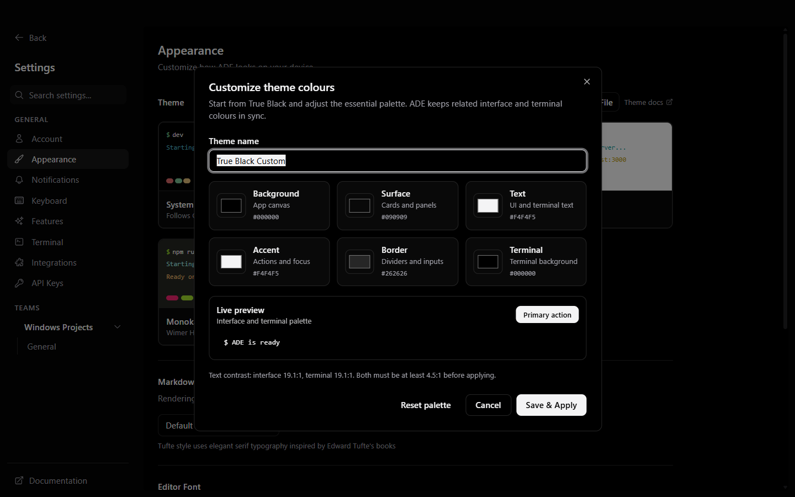
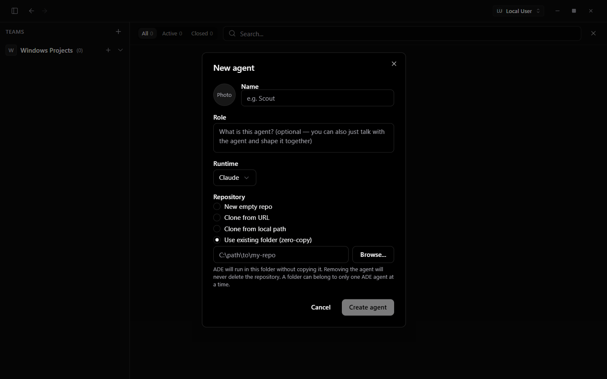
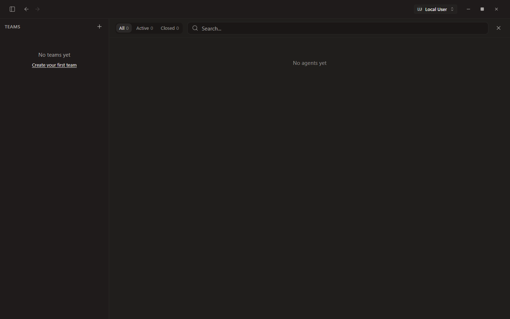

# Chi ADE Windows

> A lean, Windows-first agentic development environment with persistent agents,
> true-black theming, resumable terminal sessions, and bring-your-own AI providers.

Chi ADE Windows is a local-first, single-user desktop app for running coding agents beside your projects. Each agent has its own identity, worktree or linked project folder, terminal sessions, and long-lived markdown memory. Existing projects can be linked without copying them.

## Highlights

- **Customizable true black:** the system dark theme uses `#000000`, and the Appearance screen includes a visual editor for background, surfaces, text, accent, borders, and terminal colors.
- **Claude and Codex subscriptions:** connect through the official `claude auth login` and `codex login` flows. ADE checks only whether the CLI is installed and authenticated; it never receives the subscription credentials.
- **Durable sessions:** ADE keeps bounded terminal history and provider session metadata, then resumes Claude, Codex, Hugging Face/Codex, Ollama/Codex, and OpenCode sessions after a clean exit, app restart, or system restart when the CLI supports it.
- **Your cloud and local models:** save, select, launch, and remove multiple Hugging Face Inference Provider model IDs or models you already serve with Ollama. Hugging Face weights stay in the cloud, and ADE never pulls Ollama models automatically.
- **Provider isolation:** API tokens are encrypted with Electron secure storage and injected only into matching provider sessions.
- **Safer custom-model defaults:** Hugging Face and Ollama sessions use workspace-write isolation and ask before elevated actions.
- **Windows-aware health checks:** ADE executes each discovered CLI's `--version` command, so an inaccessible Windows Store alias is not mistaken for a working runtime.
- **Storage-conscious builds:** the Windows build runs in an isolated temporary directory, copies out only the installer/manifests, and removes staging after success.

ADE preserves your work and lets you resume or switch providers; it does not bypass Claude, Codex, Hugging Face, or other providers' usage, billing, or context limits. After a provider limit resets, resume the saved session, or continue the work in a new session with another configured provider.

## Screenshots

### Agent workspace


### Provider Hub


### Your model library


### Theme color editor



### Zero-copy existing project



### First launch



## Install

Download the Windows x64 installer from the [latest release](https://github.com/Chi944/chi-ade-windows/releases/latest):

```text
ADE-<version>-x64.exe
```

The installer is the only release artifact most users need. Agent CLIs and model weights are not bundled.

The community installer is currently unsigned, so Windows SmartScreen may show **Unknown publisher**. Before running it, verify the installer against the `ADE-<version>-x64.exe.sha256` checksum attached to the same GitHub release.

## Prerequisites

You need [Git for Windows](https://git-scm.com/download/win) and at least one coding-agent CLI:

```powershell
npm install --global @anthropic-ai/claude-code
npm install --global @openai/codex
```

OpenCode remains available as an optional runtime:

```powershell
npm install --global opencode-ai
```

Use the **+** button in the model bar to open Provider Hub:

- **Claude:** sign in with an eligible Claude subscription through the official CLI.
- **Codex:** sign in with an eligible ChatGPT/Codex subscription through the official CLI.
- **Hugging Face:** enter one token, then add up to 20 remotely available model IDs. Choose a default or launch any saved model directly; ADE does not download the weights.
- **Ollama:** add up to 20 model names already served at `127.0.0.1:11434`, choose a default, or launch one directly. ADE never pulls an Ollama model automatically.
- **OpenRouter:** enter one key for Kimi, MiniMax, and GLM sessions.

## Build from source

Requires [Bun](https://bun.sh) 1.3.6+, Node.js, and approximately 4 GiB of temporary free space.

```powershell
git clone https://github.com/Chi944/chi-ade-windows.git
Set-Location chi-ade-windows
powershell.exe -NoProfile -ExecutionPolicy Bypass -File .\scripts\build-windows-lean.ps1
```

The script:

1. prunes the monorepo to the desktop dependency closure;
2. keeps Bun and npm caches inside `.tmp/windows-build`;
3. uses published Electron native prebuilds instead of installing Visual Studio build tools;
4. smoke-tests native modules before and after packaging;
5. copies the installer, checksum, update manifest, and measured footprint to `artifacts/`; and
6. deletes temporary staging after a successful build.

Use `-KeepStaging` only for diagnostics.

For normal development:

```powershell
bun install --frozen-lockfile
bun run --cwd apps/desktop compile:app
bunx electron apps/desktop
```

## Session persistence

Each pane records a bounded terminal transcript (maximum 5 MiB) plus the actual runtime and any provider session/thread ID exposed by the CLI. On reopen, ADE uses the provider's native continuation command:

- Claude: exact `--resume <session-id>`
- Codex-backed sessions: exact `resume <thread-id>`
- OpenCode: exact `--session <session-id>`

The provider's own transcript remains the source of truth. ADE's bounded scrollback keeps local disk use predictable while preserving enough UI history to recover the workspace after a crash or restart. Permanently removed panes and closed tabs evicted from the 20-entry reopen stack have their local terminal history deleted.

## Agent memory

Every agent keeps a small, plain-markdown memory outside the project worktree:

- `AGENT.md` — identity, role, and operating brief
- `USER.md` — durable preferences and working style
- `MEMORY.md` — project conventions, lessons, and an index to longer notes
- `skills/*/SKILL.md` — reusable procedures loaded when relevant

Thin runtime bridge files feed the same canonical memory to Claude Code, Codex, and OpenCode, so switching runtimes does not discard what the agent learned. See [docs/memory.md](docs/memory.md) for the design.

## Workflow features

Chi ADE Windows already includes several ideas also found in multi-agent environments such as DevSwarm: isolated worktrees, parallel terminals, unique development ports, diff review, GitHub/PR status, external-editor handoff, and attention indicators.

Good next additions, kept out of this release until they can be implemented without bloating the app, are:

- a dependency-aware task board with bounded agent concurrency;
- searchable/exportable session transcripts;
- per-session context and cloud-cost visibility;
- reusable permission profiles; and
- explicit provider fallback policies when a service is unavailable.

## Why the small root file set?

Runtime-unnecessary community/deployment files were removed from this owner-maintained Windows fork. The following remain because they are required for licensing, attribution, packaging, or use:

- `README.md`
- `LICENSE.md`
- `NOTICE`
- `THIRD-PARTY-NOTICES.md`

## License

ADE is a modified derivative of [Superset](https://github.com/superset-sh/superset) (Copyright Superset, Inc.), distributed under the **Elastic License 2.0**. See [LICENSE.md](LICENSE.md), [NOTICE](NOTICE), and [THIRD-PARTY-NOTICES.md](THIRD-PARTY-NOTICES.md). The agent memory architecture is adapted from [NousResearch/hermes-agent](https://github.com/NousResearch/hermes-agent) (MIT).
